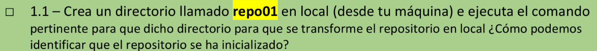
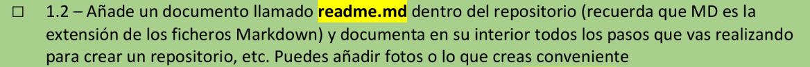
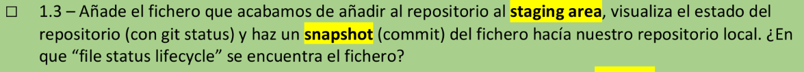
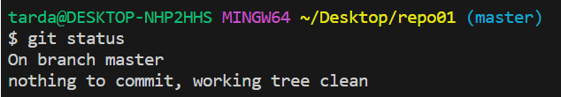
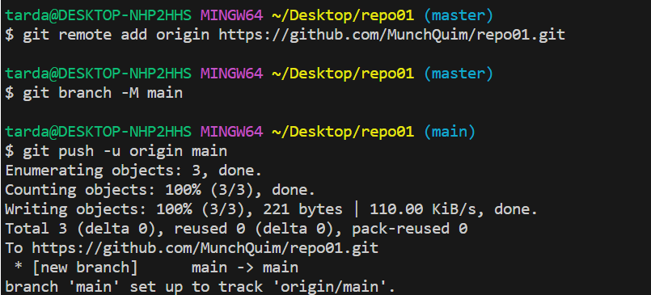
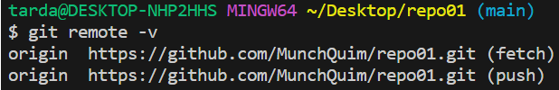
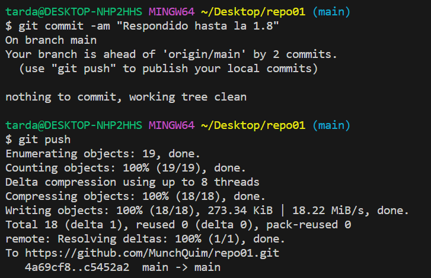

# Ejercicio 1

>1.1

>>Aparece un archivo oculto .git en el repositorio.
***
>1.2

>>pues he creado la carpeta usando el comando
cd desktop para moverme al escritorio
mkdir repo01 para crear un directorio llamado repo01
cd repo01 para moverme a la carpeta y
git init para convertir el directorio actual en un repositorio
El resto de ejercicios se iran añadiendo en el propio readme.
***
>1.3

>>se encuentra commited ( en el repositorio)
***
>1.4

>>
Ha funcionado pero porque ya habia creado previamente el remoto y enlazado con el local, de no haberlo hecho no hubiera habido un remoto al que pushear.
***
>1.5

>>
Lo dicho, si que aparece, pero porque ya lo habia enlazado previamente.
***
>1.6

>>
En esta misma imagen se muestra como lo ha sido enlazado y se han pusheado los archivos del local al remoto.
***
>1.7

>>
Porque se ha enlazado con el remoto y te lo está indicando con el "origin".
***
>1.8

>>
***
>1.9

>>Supongo que de no haber hecho un push el main y main origin estarian en diferentes commits.
